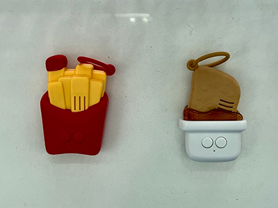
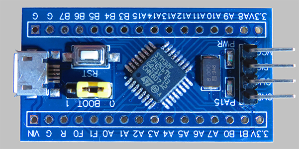
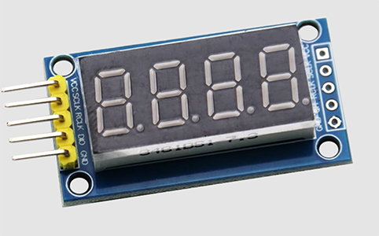
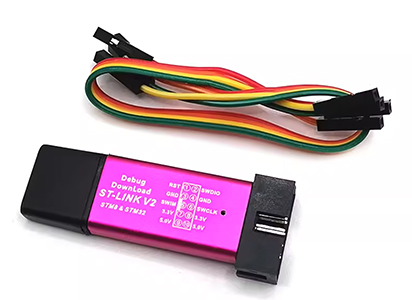
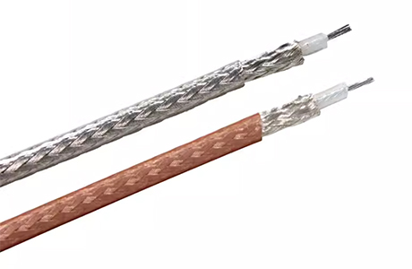
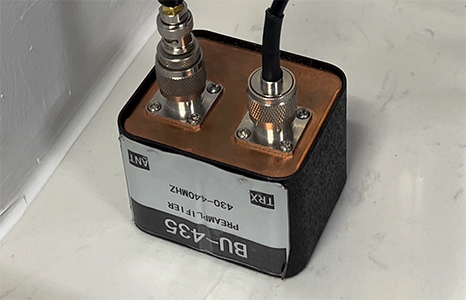
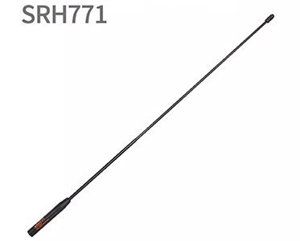
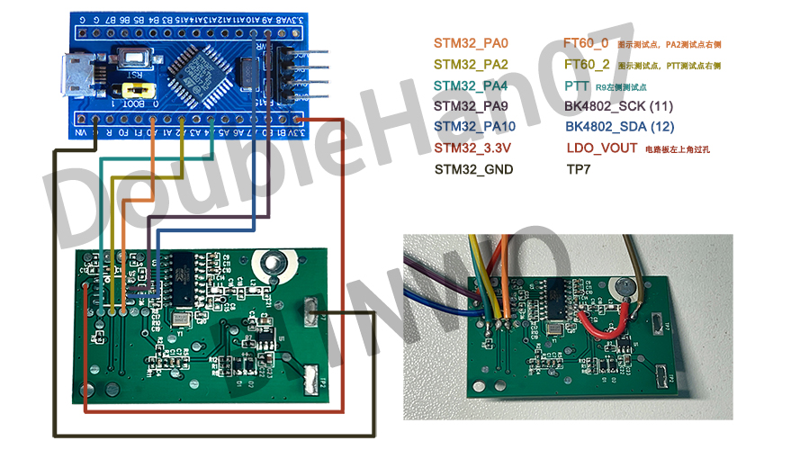
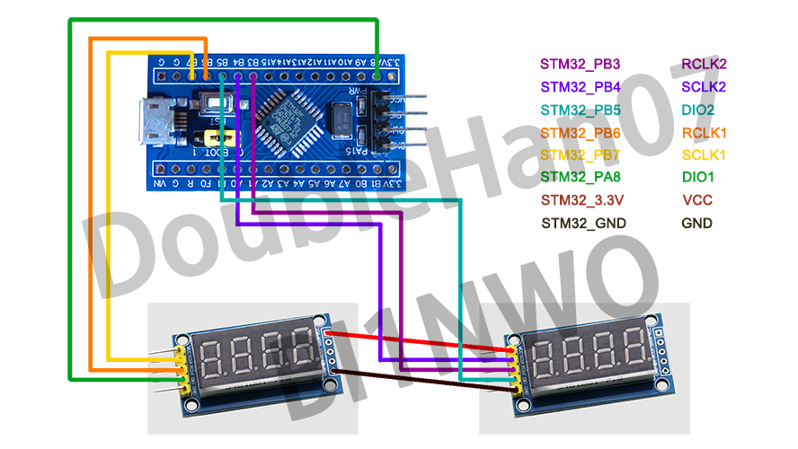

# 麦门收音机/MM-Radio
欢迎来到麦门收音机仓库！

本项目的BK4802驱动代码，参考了[BG7QKU - STM32_SIMPLE_CONTROL_BK4802N](https://github.com/BG7QKU/STM32_SIMPLE_CONTROL_BK4802N)。再次向[BG7QKU](https://github.com/BG7QKU)老师表示感谢！

## 文档/Ducumentation
- [English](README-en.md)
- [中文 (Chinese)](README.md)

## 合规提示
本项目仅提供魔改收音机的办法，```不具备任何发射功能```。

如您需要使用发射功能，请查阅相关法律法规。无线电频谱资源属于国家所有，擅自改装无线电发射设备可能违法，请勿盲目改装、发射。

如果您还不是ham，推荐您参加当地的业余无线电操作证考试，并获得业余无线电操作执照，享受更多通联乐趣。

## 版权声明
如您需要转载（包括但不限于：攥写您的公众号文章、制作各种形式各种视频平台的内容），请务必在转载文章/视频/图片等形式的```醒目位置```，标注**本项目的GitHub链接地址**，或标注我的个人呼号**BI1NWO**，否则视为侵权行为。

本项目使用[BSD 2-Clause license](./LICENSE)。

## 快速上手
如果您不需修改源代码，可以直接使用[mm.hex](./MDK-ARM/mm/mm.hex)文件。

[STM32CubeProgrammer](https://www.st.com/en/development-tools/stm32cubeprog.html)就是个可以将hex文件下载到MCU的软件。

## 模块一览
| 序号 | 模块名称 | 数量 | 用途 | 模块图片 |
|:-----|:------- |:-----|:-----|:--------|
| 1 | 麦门对酱机 | 1 | 需要一个可以随便拆解、魔改的麦门对酱机:) |  |
| 2 | [STM32F042K6T6最小系统板](https://item.taobao.com/item.htm?id=606821116231) | 1 | 替代对酱机主板的MCU |  |
| 3 | [4位数码管模块](https://detail.tmall.com/item.htm?id=44031159787&skuId=4368101738514) | 2 | 显示当前接收频率 |  |
| 4 | [ST-Link V2](https://detail.tmall.com/item.htm?id=14634569468&skuId=4805834869168) | 1 | 下载程序到最小系统板 |  |
| 5 | [50-1.5同轴线](https://item.taobao.com/item.htm?id=677546834553&skuId=5034655634918) | 0.5米 | 替换对酱机主板的天线 | 
| 6 | BU-435前置放大器 | 1 | （可选项）如果您需要接收本地中继或卫星信号，需在天线与对酱机射频输入之间加入放大器，放大射频信号 |  |
| 7 | 收音机天线 | 1 | （可选项）如果您需要接收本地中继或卫星信号，推荐使用对应频段的收音机/手台天线 |  |

## 对酱机电路原理图
[对酱机原始电路原理图](./docs/mm-circuit.pdf)

以上原理图未仔细检查，可能包含错误，请谨慎使用。

## 改造电路连接示意图




## 电路修改方法
### 第一步：拆解对酱机

### 第二步：拆掉对酱机主板的单片机

### 第三步：短路对酱机主板的滤波器电路

### 第四步：焊接跳线

### 第五步：焊接50-1.5同轴线

### 第六步：重新连接电池盒簧片

### 第七步：连接单片机和数码管


### 第八步：单片机烧录程序

## 开发者选项
如果您希望修改工程文件、源代码或单片机，最简单的方法是使用[STM32CubeMX](https://www.st.com/en/development-tools/stm32cubemx.html)软件打开[mm.ioc](./mm.ioc)，修改引脚配置、单片机资源分配情况。

### 工程结构
* [/Core](./Core/)：除了下面列出来的两个c文件，其余均为STM32CubeMX自动生成的代码
    * [main.c](./Core/Src/main.c)：初始化系统、在while循环轮询切换接收频率
    * [stm32f0xx_it.c](./Core/Src/stm32f0xx_it.c)：中断调度，主要使用了SysTick中断调度程序逻辑

* [/Drivers](./Drivers/)：STM32CubeMX自动生成的HAL库驱动代码

* [/MDK-ARM](./MDK-ARM/)：包含Keil UV5工程文件、汇编启动文件、编译好的hex文件

* [/Users](./Users/)：我自己写的驱动
    * [bk4802.c](./Users/bk4802.c)：BK4802的驱动代码
    * [delay.c](./Users/delay.c)：精确毫秒延时函数
    * [exti.c](./Users/exti.c)：电源键和PTT键功能定义，使用边沿触发中断方式读取按键
    * [segment_display.c](./Users/segment_display.c)：数码管的驱动代码
